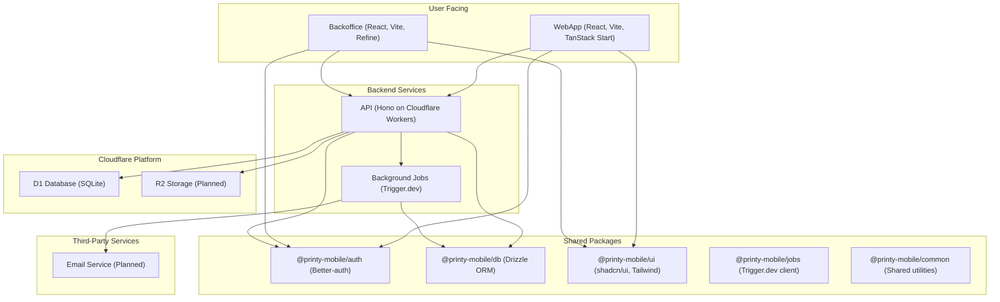

# Printy Mobile System Architecture

## Core Services & Infrastructure

## Service Roles

1.  **Authentication & User Management**
    - 🔐 **Better-auth**: Handles user authentication, identity management, and social logins via the `@printy-mobile/auth` package.

2.  **Data Storage**
    - 💾 **Cloudflare D1**: Primary SQLite database for all application data. Managed via Drizzle ORM in the `@printy-mobile/db` package.
    - 🖼️ **Cloudflare R2 (Planned)**: Will be used to store user-uploaded media.

3.  **Backend API**
    - 🚀 **Hono on Cloudflare Workers**: The core API that handles all client requests, business logic, and coordinates with other backend services.

4.  **Admin Interface**
    - Admin **Backoffice (Refine)**: A pre-built admin panel for managing application data and users, leveraging the Refine framework for rapid development.

5.  **Background Processing**
    - ⚡ **Trigger.dev**: Orchestrates asynchronous background jobs for tasks like sending email notifications, and other long-running processes. The client is configured in `@printy-mobile/jobs`.

6.  **Notifications**
    - 📧 **SMTP Service (Planned)**: Will deliver email notifications for events like registration, social interactions, and system alerts.

7.  **Shared UI & Logic**
    - 🎨 **`@printy-mobile/ui`**: A shared component library built with shadcn/ui, Radix, and Tailwind CSS.
    - 🛠️ **`@printy-mobile/common`**: Shared utilities and types used across the monorepo.

## Key Architectural Principles

- **Serverless First**: The entire backend is built on serverless components (Cloudflare Workers, D1, R2) to ensure high scalability, low operational overhead, and cost-efficiency.
- **Monorepo Structure**: A Turborepo setup organizes the frontend, API, and shared packages, streamlining development and dependency management.
- **Type-Safe Everywhere**: Leveraging TypeScript across the stack, with Drizzle ORM providing type-safe database queries and Hono RPC for type-safe client-server communication.
- **Asynchronous Operations**: Using background jobs for long-running or non-critical tasks to ensure the API remains fast and responsive.
- **Rapid Internal Tooling**: Using Refine.js for the backoffice to quickly build a feature-rich and stable admin interface.

## Infrastructure Benefits

1.  **Managed Services**
    - Reduced operational overhead
    - Automatic scaling
    - Built-in monitoring

2.  **Security**
    - Modern authentication via Better-auth
    - Secure, managed infrastructure from Cloudflare
    - Token-based authentication for API access

3.  **Reliability**
    - Distributed architecture
    - Fault tolerance
    - Data redundancy 